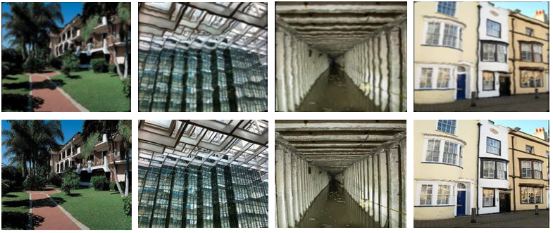
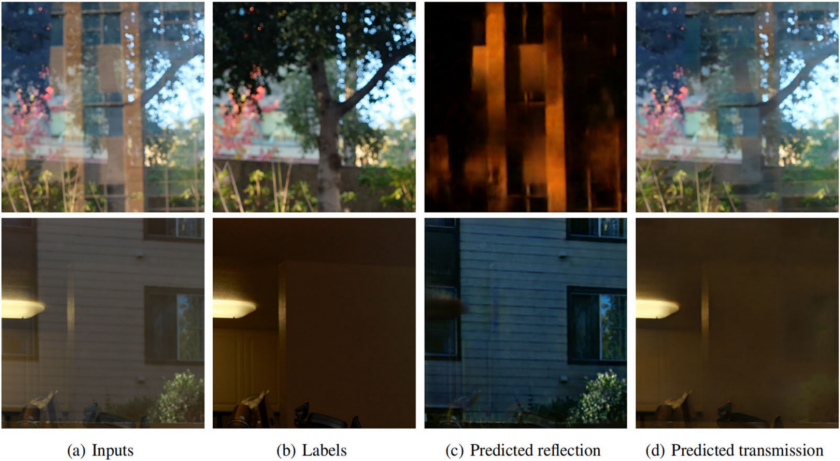
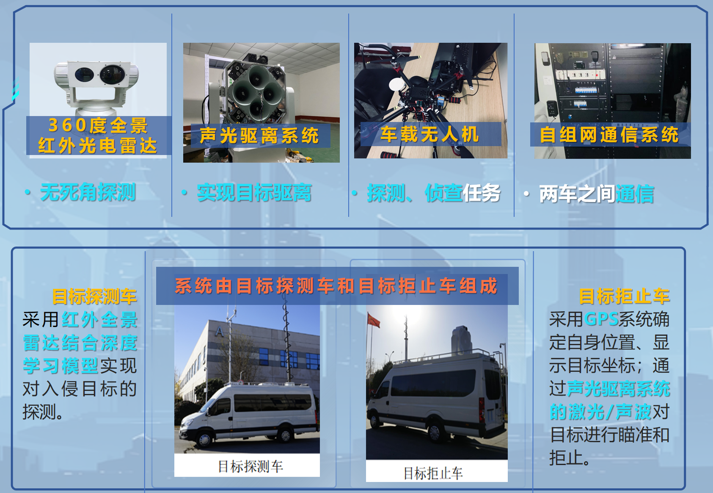
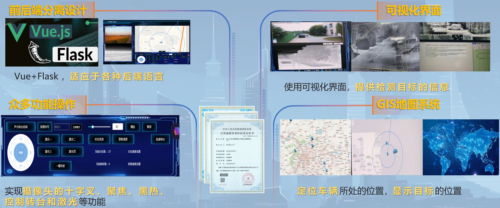
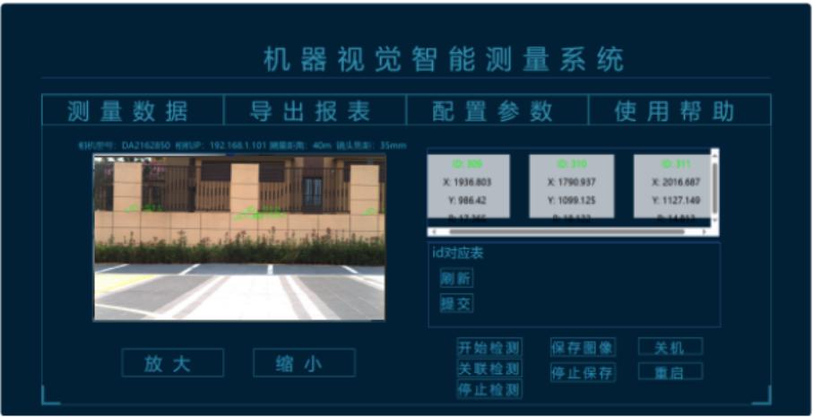
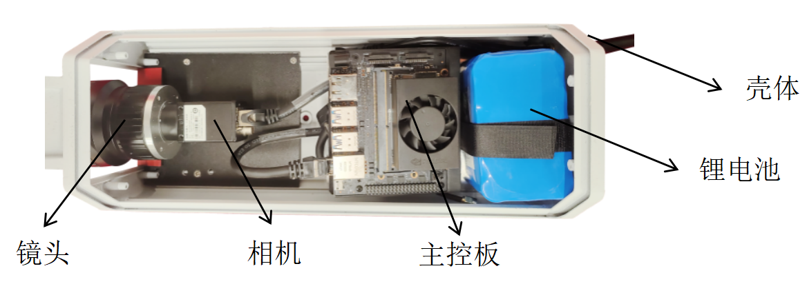

成宽洪，西安理工大学计算机科学与工程学院讲师。美国光学学会会员，中国光学学会终身会员，2020年获西安电子科技大学电子科学与技术专业博士学位，2018-2019在新加坡南洋理工大学计算机科学与工程学院访问。现主要从事光电成像及图像处理、目标检测跟踪、图像质量提升等方面的科研工作。主持和参与相关国家自然科学基金项目6项，863计划、预研项目、教育部科学技术研究重点项目、航空科学基金等项目多项；获陕西高校科技成果二等奖1项，发表学术论文30余篇，授权发明专利14项，国际专利2项。

## 部分科研项目

|               项目名称               |    项目来源     | 角色 |
|:--------------------------------:|:-----------:|:--:|
|    面向反射干扰场景的多源监督图像复原技术研究    |  国家自然科学基金   | 主持 |
|         	目标探测与拒止系统软件设计          |     横向      | 主持 |
|            	光电成像侦察装备升级            |     横向      | 主持 |
|    机器视觉智能测量系统-视觉智能测量软件研发     |     横向      | 主持 |
|         光电成像设备调参操作实验设计          |     横向      | 主持 |
|    面向公共安全的多模态场景感知与异常行为预警系统及应用    | 陕西省创新能力引导专项 | 参与 |
|     双模态图像噪声隐式建模的低照度视频增强理论应用      |  国家自然科学基金   | 参与 |
|    基于XXX的红外弱小目标检测与识别算法研究     | 航空科学基金  | 参与 |

## 教育经历

2020-至今  西安理工大学 讲师

2018-2019 新加坡南洋理工大学 计算机科学与工程学院 联合培养

2013-2020 西安电子科技大学 物理与光电工程学院 电子科学与技术 硕博连读

2008-2012 西安电子科技大学 技术物理学院 光信息科学与技术 本科

研究方向
======
## 1. 病态图像复原

采用图像处理和计算机视觉方法解决反射干扰、大气湍流干扰、图像HDR、图像修复、传感器非均匀性等高度病态的图像退化问题，部分项目成果如下

### 1.1 湍流畸变校正

### 1.2 反射干扰消除

## 2. 目标检测跟踪

针对红外、可见光视频场景下的弱小目标进行检测和跟踪研究
### 2.1 复杂地面背景下的目标检测跟踪

## 3. 光电成像与图像处理系统工程应用

将算法理论工程化，并针对不同场景开发相关软硬件系统，以解决实际应用需求，部分项目成果如下

### 3.1 移动式目标探测驱离系统

### 3.2 嵌入式靶标探测与沉降监测系统（可实现纯视觉100m处±2mm位移监测）

