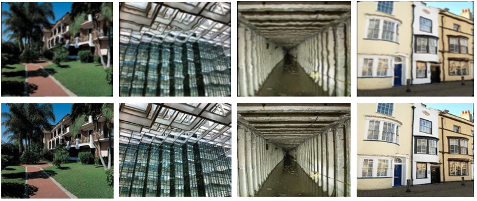
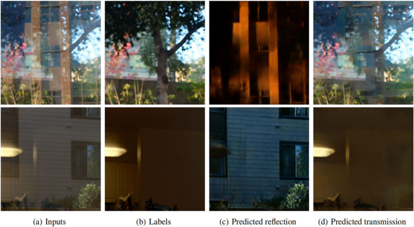

This is the front page of a website that is powered by the [Academic Pages template](https://github.com/academicpages/academicpages.github.io) and hosted on GitHub pages. [GitHub pages](https://pages.github.com) is a free service in which websites are built and hosted from code and data stored in a GitHub repository, automatically updating when a new commit is made to the repository. This template was forked from the [Minimal Mistakes Jekyll Theme](https://mmistakes.github.io/minimal-mistakes/) created by Michael Rose, and then extended to support the kinds of content that academics have: publications, talks, teaching, a portfolio, blog posts, and a dynamically-generated CV. You can fork [this template](https://github.com/academicpages/academicpages.github.io) right now, modify the configuration and markdown files, add your own PDFs and other content, and have your own site for free, with no ads!

基本信息
======
成宽洪，男，博士，西安理工大学计算机科学与工程学院讲师。美国光学学会会员，中国光学学会终身会员，“图像处理与视觉计算”陕西高校青年创新团队核心成员。2020年获西安电子科技大学电子科学与技术专业博士学位，2018-2019在新加坡南洋理工大学计算机科学与工程学院访问。现主要从事光电成像及图像处理、光电目标检测跟踪、光电图像质量提升等方面的科研工作。主持和参与相关国家自然科学基金项目6项，863计划、国防创新项目、国防预研项目、教育部科学技术研究重点项目、航空科学基金、重点实验室基金等项目多项；获陕西高校科技成果二等奖1项，发表学术论文30余篇，授权发明专利14项，国际专利2项。

## 科研项目

|               项目名称               |    项目来源     | 角色 |
|:--------------------------------:|:-----------:|----|
|      面向反射干扰场景的多源监督图像复原技术研究  |  国家自然科学基金   | 主持 |
|    	目标探测与拒止系统软件设计               |     横向      | 主持 |
|            	光电成像侦察装备升级            |     横向      | 主持 |
|     机器视觉智能测量系统-视觉智能测量软件研发    |     横向      | 主持 |
|        光电成像设备调参操作实验设计           |     横向      | 主持 |
|    面向公共安全的多模态场景感知与异常行为预警系统及应用    | 陕西省创新能力引导专项 | 参与 |
|     双模态图像噪声隐式建模的低照度视频增强理论应用      |  国家自然科学基金   | 参与 |
|   基于XXX的红外弱小目标检测与识别算法研究      | 航空科学基金  | 参与 |

	

[//]: # (![img_1.png]&#40;img_1.png&#41;)
## 教育经历

2020-至今  西安理工大学 讲师

2018-2019 新加坡南洋理工大学 计算机科学与工程学院 联合培养

2013-2020 西安电子科技大学 物理与光电工程学院 电子科学与技术 硕博连读

2008-2012 西安电子科技大学 技术物理学院 光信息科学与技术 本科

研究方向
======
## 1. 病态图像复原

采用图像处理和计算机视觉方法解决反射干扰、大气湍流干扰、图像HDR、图像修复、传感器非均匀性等高度病态的图像退化问题

## 2. 目标检测跟踪

针对红外、可见光视频场景下的弱小目标进行检测和跟踪研究

## 3. 光电成像与图像处理系统工程应用

将算法理论工程化，并针对不同场景开发相关软硬件系统，以解决实际应用需求

A data-driven personal website
======
Like many other Jekyll-based GitHub Pages templates, Academic Pages makes you separate the website's content from its form. The content & metadata of your website are in structured markdown files, while various other files constitute the theme, specifying how to transform that content & metadata into HTML pages. You keep these various markdown (.md), YAML (.yml), HTML, and CSS files in a public GitHub repository. Each time you commit and push an update to the repository, the [GitHub pages](https://pages.github.com/) service creates static HTML pages based on these files, which are hosted on GitHub's servers free of charge.

Many of the features of dynamic content management systems (like Wordpress) can be achieved in this fashion, using a fraction of the computational resources and with far less vulnerability to hacking and DDoSing. You can also modify the theme to your heart's content without touching the content of your site. If you get to a point where you've broken something in Jekyll/HTML/CSS beyond repair, your markdown files describing your talks, publications, etc. are safe. You can rollback the changes or even delete the repository and start over - just be sure to save the markdown files! Finally, you can also write scripts that process the structured data on the site, such as [this one](https://github.com/academicpages/academicpages.github.io/blob/master/talkmap.ipynb) that analyzes metadata in pages about talks to display [a map of every location you've given a talk](https://academicpages.github.io/talkmap.html).

Getting started
======
1. Register a GitHub account if you don't have one and confirm your e-mail (required!)
1. Fork [this template](https://github.com/academicpages/academicpages.github.io) by clicking the "Use this template" button in the top right. 
1. Go to the repository's settings (rightmost item in the tabs that start with "Code", should be below "Unwatch"). Rename the repository "[your GitHub username].github.io", which will also be your website's URL.
1. Set site-wide configuration and create content & metadata (see below -- also see [this set of diffs](http://archive.is/3TPas) showing what files were changed to set up [an example site](https://getorg-testacct.github.io) for a user with the username "getorg-testacct")
1. Upload any files (like PDFs, .zip files, etc.) to the files/ directory. They will appear at https://[your GitHub username].github.io/files/example.pdf.  
1. Check status by going to the repository settings, in the "GitHub pages" section

Site-wide configuration
------
The main configuration file for the site is in the base directory in [_config.yml](https://github.com/academicpages/academicpages.github.io/blob/master/_config.yml), which defines the content in the sidebars and other site-wide features. You will need to replace the default variables with ones about yourself and your site's github repository. The configuration file for the top menu is in [_data/navigation.yml](https://github.com/academicpages/academicpages.github.io/blob/master/_data/navigation.yml). For example, if you don't have a portfolio or blog posts, you can remove those items from that navigation.yml file to remove them from the header. 

Create content & metadata
------
For site content, there is one markdown file for each type of content, which are stored in directories like _publications, _talks, _posts, _teaching, or _pages. For example, each talk is a markdown file in the [_talks directory](https://github.com/academicpages/academicpages.github.io/tree/master/_talks). At the top of each markdown file is structured data in YAML about the talk, which the theme will parse to do lots of cool stuff. The same structured data about a talk is used to generate the list of talks on the [Talks page](https://academicpages.github.io/talks), each [individual page](https://academicpages.github.io/talks/2012-03-01-talk-1) for specific talks, the talks section for the [CV page](https://academicpages.github.io/cv), and the [map of places you've given a talk](https://academicpages.github.io/talkmap.html) (if you run this [python file](https://github.com/academicpages/academicpages.github.io/blob/master/talkmap.py) or [Jupyter notebook](https://github.com/academicpages/academicpages.github.io/blob/master/talkmap.ipynb), which creates the HTML for the map based on the contents of the _talks directory).

**Markdown generator**

The repository includes [a set of Jupyter notebooks](https://github.com/academicpages/academicpages.github.io/tree/master/markdown_generator
) that converts a CSV containing structured data about talks or presentations into individual markdown files that will be properly formatted for the Academic Pages template. The sample CSVs in that directory are the ones I used to create my own personal website at stuartgeiger.com. My usual workflow is that I keep a spreadsheet of my publications and talks, then run the code in these notebooks to generate the markdown files, then commit and push them to the GitHub repository.

How to edit your site's GitHub repository
------
Many people use a git client to create files on their local computer and then push them to GitHub's servers. If you are not familiar with git, you can directly edit these configuration and markdown files directly in the github.com interface. Navigate to a file (like [this one](https://github.com/academicpages/academicpages.github.io/blob/master/_talks/2012-03-01-talk-1.md) and click the pencil icon in the top right of the content preview (to the right of the "Raw | Blame | History" buttons). You can delete a file by clicking the trashcan icon to the right of the pencil icon. You can also create new files or upload files by navigating to a directory and clicking the "Create new file" or "Upload files" buttons. 

Example: editing a markdown file for a talk

For more info
------
More info about configuring Academic Pages can be found in [the guide](https://academicpages.github.io/markdown/), the [growing wiki](https://github.com/academicpages/academicpages.github.io/wiki), and you can always [ask a question on GitHub](https://github.com/academicpages/academicpages.github.io/discussions). The [guides for the Minimal Mistakes theme](https://mmistakes.github.io/minimal-mistakes/docs/configuration/) (which this theme was forked from) might also be helpful.
